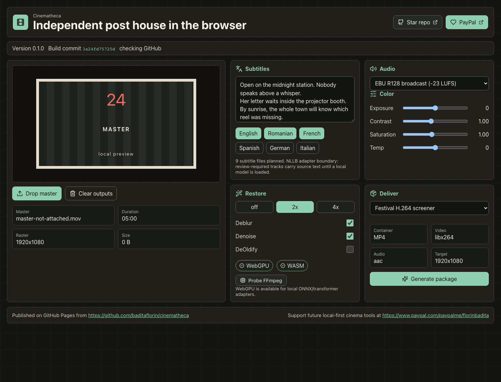
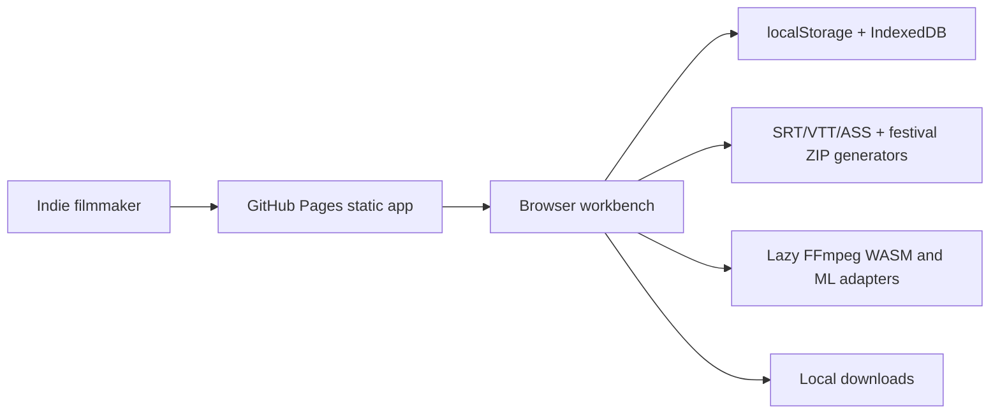

# Cinematheca


Live app: https://baditaflorin.github.io/cinematheca/

Repository: https://github.com/baditaflorin/cinematheca

Support: https://www.paypal.com/paypalme/florinbadita

Cinematheca is a browser-based post-production toolkit for indie filmmakers: subtitles, loudness, color, restoration, and delivery exports. It keeps masters local, generates review-ready subtitle and delivery packages, and publishes as a static GitHub Pages app.



## Quickstart

```sh
npm install
make dev
make build
make test
make smoke
```

## Architecture

This is a Mode A GitHub Pages app. Media stays local in the browser; no backend receives source footage.



Architecture docs:

docs/architecture.md

ADR directory:

docs/adr/
