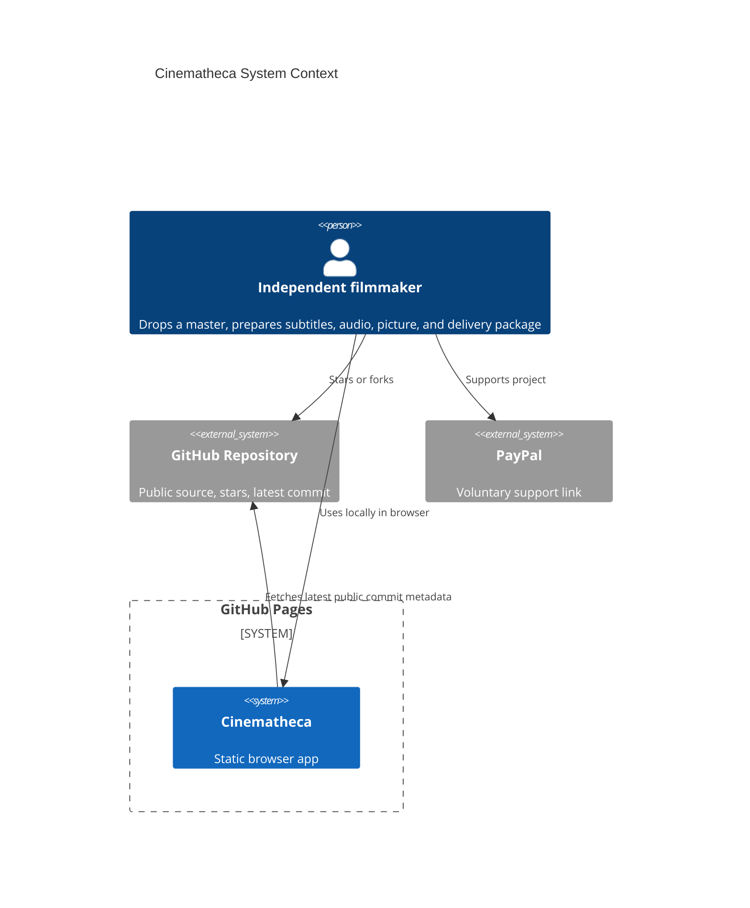
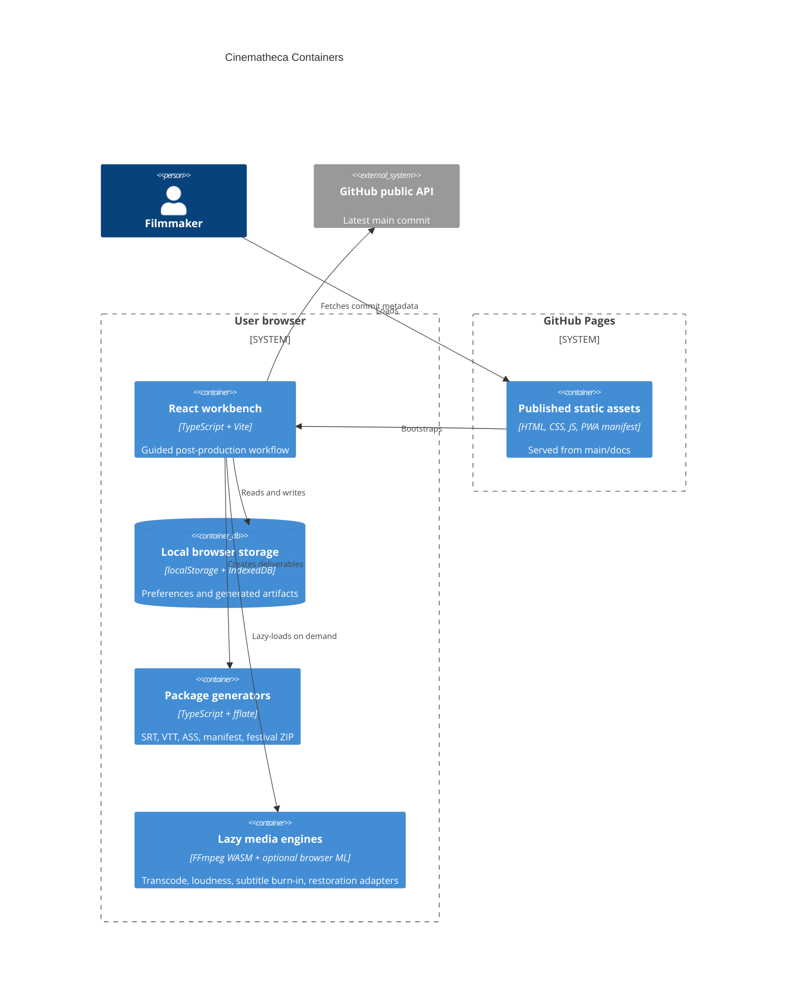

# Architecture

## Context

Live app:

https://baditaflorin.github.io/cinematheca/

Repository:

https://github.com/baditaflorin/cinematheca

## Containers

## Module Boundaries

- `src/features/master`: file intake and metadata.
- `src/features/subtitles`: transcript segmentation and subtitle formats.
- `src/features/audio`: EBU R128 loudness recipes.
- `src/features/picture`: color, restoration, and preview settings.
- `src/features/delivery`: presets, command plans, manifests, ZIP packages.
- `src/features/storage`: local browser persistence.
- `src/features/engines`: lazy FFmpeg and ML capability adapters.

## Pages Boundary

GitHub Pages serves only static files from `main` branch `/docs`. There is no runtime backend, no server database, and no server-side media processing.
